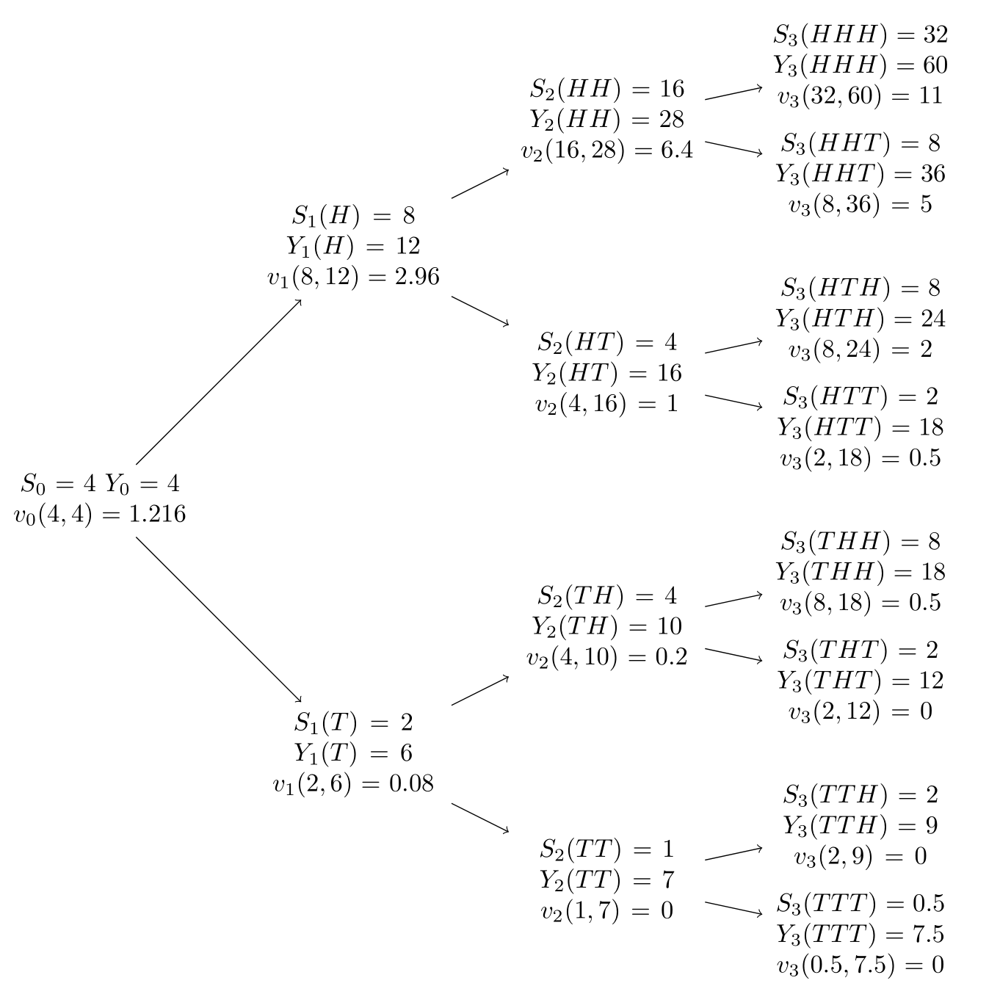

```{r, setup, include=FALSE}
knitr::opts_chunk$set(warning=FALSE,
                      message=FALSE,
                      echo=FALSE, 
                      fig.width=8)
## collapse = TRUE
# dec = 'jpeg'
# eval = FALSE
# https://yihui.org/knitr/options/#chunk-options
library(tidyverse)
library(latex2exp)
```

::: {.exercise  name=""}

$\quad$

:::


:::: {.solution}

a.
$$
\begin{aligned}
    v_n(s,y)&=\frac{1}{1+r} \left[ \hat{p}v_{n+1}(us,y+us)+\hat{q}v_{n+1}(ds,y+ds) \right]
    \\ &= 
    \frac{2}{5} \left[ v_{n+1}(2s,y+2s)+v_{n+1}\left( \frac{s}{2},y+\frac{s}{2} \right) \right]
\end{aligned}
$$

b. See figure \@ref(fig:tree)

```{r tree, fig.align = "center", fig.cap="Asian option", out.width = '50%'}



```

c.
$$
\delta_{n}(s,y)= \frac{v_{n+1}(us,y+us)-v_{n+1}(ds,y+ds)}{(u-d)s}
$$


::::


